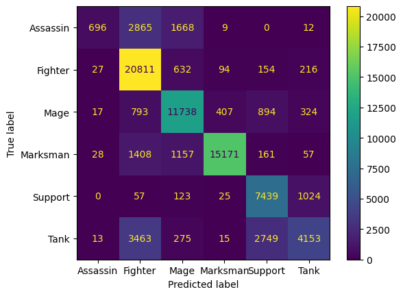
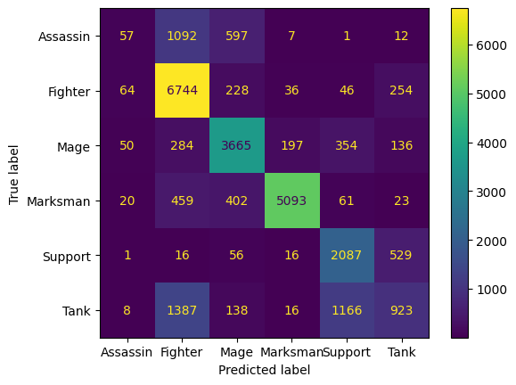
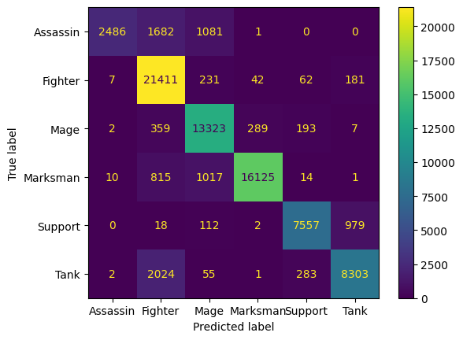
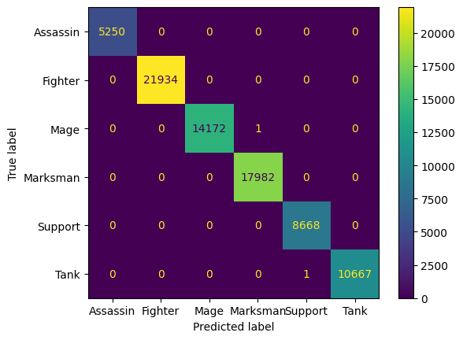

### DSC 80 Project
***By Katelyn Abille and Aneesh Pamula***    
Curated by students of DSC 80, this academic project is a continuation of our previous exploratory data analysis performed on League of Legends 2022 competitive matches data. Our website stands as a holistic report of our findings, demonstrating the process of cleaning, transforming, and fitting our data for a prediction model, as well as assessing the fairness of our model.
> Our exploratory data analysis on this dataset can be found here:
>   [An Analysis of Renekton's Presence During the 2022 Season of Professional League of Legends](https://katemae.github.io/esports-data-report/).

 

### **Table of Contents**
1. [Framing the Problem](#frame_problem)  
    a. [Description of Data](#data_desc)  
    b. [The Main Plan](#plan)
3. [Baseline Model](#baseline_model)  
    a. [Model Evaluation](#base_eval)  
4. [Final Model](#final_model)  
    a. [Data Justification](#justify_data)  
    b. [Model Optimization](#optimize)  
5. [Fairness Analysis](#fairness) 
    a. [Background Information](#bg_info)  
    b. [Hypothesis Testing](#hyp_test)  

 

## **Framing the Problem** 

League of Legends is a game that features a very diverse cast of over 160 characters, or champions, who each have their own unique abilities and techniques. Nonetheless, with over 160 champions, some will have similar playstyles and are thus grouped into **classes**. 

League of Legends features six main classes for its champions, each with its own unique strengths and weaknesses:

#### **Tanks**

Tanks, like Shen (shown above), are very difficult to kill and excel at disrupting enemies and forcing attention to themselves, but they often do not deal a lot of damage.

#### **Fighters**

Fighters, like Renekton (shown above), are great at taking long fights with enemies due to their consistent damage and resistances, but often lack the ability to deal with long-ranged opponents.

#### **Assassins**

Assassins, like Kayn (shown above), can deal a huge burst of damage to a single target in a short time and have great mobility, but they often lack defenses and lack sustained damage after the initial burst.

#### **Mages**

Mages, like Lux (shown above), can damage enemies from a distance with area-of-effect abilities that can hit multiple targets, but these abilities can be dodged by champions with high mobility and must take time to recharge before being used again.

#### **Marksmen**

Marksmen, like Jinx (shown above), pressure enemies from a distance with their long range and sustained damage, but often die very quickly once enemies get within reach of them.

#### **Supports**

Supports, like Lulu (shown above), can offer a wide range of utility such as stuns, healing, and damage buffs, but they do not do very much damage and are often very weak without a teammate alongside them.

 

Due to each of the classes having different affinities, the distributions of their post-game statistics also tends to be quite different. For example, assassins and marksmen may have a very high number of kills, while supports may tend to have more assists. **Because of this, we have chosen for our report to create a model that predicts which class of champion a player was playing given their post-game statistics**.

### **Description of Data** 

Because we are predicting class based on *post-game* statistics, we have free reign on all columns since they are within the *"time of prediction"*. The post-game data that we will be using are the following:

* `'position'`: The position that the champion was played in. This could be top, jungle (abbreviated to jng), middle (abbreviated to mid), bottom, (abbreviated to bot), and support (abbreviated to sup).

* `'gamelength'`: The length of the game in seconds.

* `'kills'`, `'deaths'`, and `'assists'`: `'kills'` represents the number of times the player scored a kill on an opponent, while `'deaths'` represents the number of times the player died. `'assists'` represents the number of times the player aided their teammates in killing another opponent without actually scoring the kill themselves.

* `'doublekills'`, `'triplekills'`, `'quadrakills'`, and `'pentakills'`: The number of times a player killed two, three, four or five (respectively) players in quick succession.

* `'dpm'`, `'damagetakenperminute'`, and `'damagemitigatedperminute'`: The amount of damage dealt, taken, and mitigated (that is, reduced with shields, healing, armor, etc.), all averaged over the length of the game in minutes.

* `'wpm'`, `'wcpm'`, `'controlwardsbought'`, and `'vspm'`: The number of wards (objects that grant vision) placed and destroyed, averaged over the length of the game in minutes, and the number of control wards (a stronger version of wards) bought. `'vspm'` is the vision score (a number that reflects how much a player granted vision to their team and denied it from the opponent) averaged over the length of the game in minutes.

* `'minionkills'` and `'monsterkills'`: The number of minions and monsters killed by the player. Minions spawn in the top, middle, and bottom lanes, while monsters spawn in the jungle.

* `'goldat15'`, `'xpat15'`, `'csat15'`,`'killsat15'`, `'assistsat15'`, and `'deathsat15'`: Various statistics at the 15 minute mark of the game. Gold is a resource that allows players to buy items, and experience (abbreviated to xp here) allows champions to strengthen their abilities and grow more powerful. CS is a statistic that reflects the number of minions and monsters a player has killed.

* `'golddiffat15'`, `'xpdiffat15'`, `'csdiffat15'`: The difference between the player's gold and their lane opponent's gold, experience, and CS at the 15 minute mark.

It is also important to note that `'kills'`, `'deaths'`, and `'assists'` vary from `'killsat15'`, `'assistsat15'`, and `'deathsat15'`. Statistics within the first 15 minutes of a game are vital to our predictions and to a game's overall outcome, as some champions have different early game strategies.

Thus, we will keep all the above columns in our dataset, along with the column corresponding to a champion's class to test our model on.

 

Before we proceed, however, we must first address some of the missing values in our dataset. The vast majority of the missing values are missing by design (MD) because certain leagues do not keep track of certain statistics. For example, leagues like LPL and LDL do not keep track of statistics like gold difference at 15 minutes, or damage mitigated per minute. These statistics are essential to make our predictions, since sometimes getting an early lead over the opponent or mitigating damage is a key part of the playstyle of a class as described earlier. 

Because of this, we will be removing the rows corresponding to leagues that do not store the data we require in the dataset used for our model. Specifically, leagues 'LPL', 'LDL', 'WLDs', and 'DCup' have been completely removed from our data. Additionally, like our previous project, we have removed rows of data containing aggregated team statistics since they are irrelevant to determining an *individual's* champion.

 

With missing values accounted for and the specific statistics chosen, we are left with 104900 rows and 28 columns of data:

| class    |   gamelength | position   |   kills |   deaths |   assists |   doublekills |   triplekills |   quadrakills |   pentakills |     dpm |   damagetakenperminute |   damagemitigatedperminute |    wpm |   wcpm |   controlwardsbought |   vspm |   minionkills |   monsterkills |   goldat15 |   xpat15 |   csat15 |   golddiffat15 |   xpdiffat15 |   csdiffat15 |   killsat15 |   assistsat15 |   deathsat15 |
|:---------|-------------:|:-----------|--------:|---------:|----------:|--------------:|--------------:|--------------:|-------------:|--------:|-----------------------:|---------------------------:|-------:|-------:|---------------------:|-------:|--------------:|---------------:|-----------:|---------:|---------:|---------------:|-------------:|-------------:|------------:|--------------:|-------------:|
| Fighter  |         1713 | top        |       2 |        3 |         2 |             0 |             0 |             0 |            0 | 552.294 |               1072.4   |                    777.793 | 0.2802 | 0.2102 |                    5 | 0.9107 |           220 |             11 |       5025 |     7560 |      135 |            391 |          345 |           14 |           0 |             1 |            0 |
| Fighter  |         1713 | jng        |       2 |        5 |         6 |             0 |             0 |             0 |            0 | 412.084 |                944.273 |                    650.158 | 0.2102 | 0.6305 |                    6 | 1.6813 |            33 |            115 |       5366 |     5320 |       89 |            541 |         -275 |          -11 |           2 |             3 |            2 |
| Assassin |         1713 | mid        |       2 |        2 |         3 |             0 |             0 |             0 |            0 | 499.405 |                581.646 |                    227.776 | 0.6655 | 0.2452 |                    7 | 1.0158 |           177 |             16 |       5118 |     6942 |      120 |           -475 |          153 |            1 |           0 |             3 |            0 |
| Marksman |         1713 | bot        |       2 |        4 |         2 |             0 |             0 |             0 |            0 | 389.002 |                463.853 |                    218.879 | 0.4203 | 0.2102 |                    4 | 0.8757 |           208 |             18 |       5461 |     4591 |      115 |           -793 |        -1343 |          -34 |           2 |             1 |            2 |
| Tank     |         1713 | sup        |       1 |        5 |         6 |             0 |             0 |             0 |            0 | 128.301 |                475.026 |                    490.123 | 1.0158 | 0.4904 |                   11 | 2.4168 |            42 |              0 |       3836 |     3588 |       28 |            443 |         -497 |            7 |           1 |             2 |            2 |
| ...      |          ... | ...        |     ... |      ... |       ... |           ... |           ... |           ... |          ... |     ... |                    ... |                        ... |    ... |    ... |                  ... |    ... |           ... |            ... |        ... |      ... |      ... |            ... |          ... |          ... |         ... |           ... |          ... |
| Tank     |         1680 | top        |       3 |        5 |         0 |             1 |             0 |             0 |            0 | 259.964 |                864.286 |                   1027.04  | 0.3214 | 0.1786 |                    1 | 0.8571 |           162 |              0 |       4948 |     6973 |      108 |          -1537 |         -645 |          -15 |           2 |             0 |            1 |
| Fighter  |         1680 | jng        |       2 |        8 |         4 |             0 |             0 |             0 |            0 | 273.857 |                992.321 |                    948.286 | 0.6429 | 0.1071 |                   11 | 1.2143 |            18 |            124 |       4798 |     5504 |       93 |           -403 |          706 |           13 |           1 |             4 |            3 |
| Assassin |         1680 | mid        |       2 |        3 |         3 |             0 |             0 |             0 |            0 | 424.107 |                835.857 |                    580.75  | 0.3571 | 0.1071 |                    5 | 1      |           231 |              8 |       5283 |     7347 |      122 |            342 |          270 |           -4 |           1 |             2 |            0 |
| Marksman |         1680 | bot        |       2 |        1 |         3 |             0 |             0 |             0 |            0 | 386.321 |                332.643 |                    199.143 | 0.4643 | 0.2143 |                    5 | 1.0357 |           224 |             12 |       5012 |     5012 |      114 |           -475 |         -866 |          -11 |           1 |             1 |            0 |
| Mage     |         1680 | sup        |       0 |        5 |         4 |             0 |             0 |             0 |            0 | 243.964 |                553.964 |                    386.679 | 0.8929 | 0.2143 |                    8 | 2.1786 |            16 |              0 |       3192 |     3586 |        2 |           -140 |           19 |           -1 |           0 |             3 |            2 |

### **The Main Plan** 

Now that our data is cleaned, we can formally outline the goals and plans for our model.

As explained earlier, the **response variable** we will be predicting for is the **class** of a player's champion, which is a nominal variable that can be one of six classes described above. (Note that our `'class'` column has been manually added to the data by web scraping the [League of Legends official website](https://www.leagueoflegends.com/en-us/champions/) for the class of each unique champion). Because of the varying outcomes there may be,  we have chosen to use a **multiclass classification** by implementing a *random forest classifier*.

The metric we will be using to evaluate our model will be **F1-Score**.

<iframe src="assets/fig/class_imbalance.html" width=800 height=600 frameBorder=0></iframe>

As seen above, the distribution of the data amongst the six classes does not align with their presence out of all champions, nor is the data evenly balanced amongst all six classes. Because of this class imbalance, we cannot rely on accuracy as our evaluation metric and instead will be using the weighted average of **F1-Scores** from each class.

Now we are ready for predictive modeling!

## **Baseline Model** 

Before working with all our columns, we will first create a baseline model using only five columns from our dataset to predict the champion class: `'gamelength'`, `'kills'`, `'deaths'`, `'assists'`, and `'position'`. These statistics are fairly easy to explain to someone who does not know much about League of Legends in contrast to statistics like gold and experience difference. Additionally, these five are a great baseline since they are likely correlated with the class of a champion and are basic statistics easily found for all matches, not just competitive games.

#### **`'position'`**

We include this **nominal** feature because each position has certain characteristics that make some classes stronger in those positions than others. For example, fighters are often played in the top lane because they are more self-sufficient and do not need the help of their teammates, who are spread throughout the rest of the map. Meanwhile, assassins are often played in the jungle because their high mobility allows them to get around the map faster.

Because this is a nominal feature, we need to quantify the data to be compatible with our classifier. To do so, we perform a One-Hot Encoding on this column.

#### **`'gamelength'`**

We include this **quantitative** feature because different classes tend to be stronger at different levels of the game. For example, a fighter or assassin may contribute the majority of their team's damage in a short (around 25 minutes or less) game, while a marksman will likely contribute the majority of their team's damage in longer games.

Because this column is recorded in seconds, there is a LARGE variety of values stored (around 1625 unique values to be exact), with a minimum of 921 seconds and a maximum of 3577 seconds. For the purposes of our analysis, we will perform a Quantile Transformation. This way, the `'gamelength'` column will display whether the game length was in the 10th percentile of game lengths, the 20th percentile of game lengths, etc.

#### **`'kills'`, `'deaths'`, and `'assists'`**

We include these three **quantitative** features because some classes prioritize aiding their teammates in killing an enemy, while other classes want to be the ones to score those kills. For example, a support or tank champion may focus more on setting up kills for their assassin or marksman teammates rather than actually going for the kills themselves, leading to a low number of kills but high number of assists. Classes who tend to be the first to enter a fight may also end up dying more.

For our model, we will standardize the `'kills'`, `'deaths'`, and `'assists'` column based on game length using a manually-created `StdScalerByGroup` class. This transformation gives more context to these statistics--for example, earning 5 total kills in a 20 minute game would be much more impressive than earning 5 total kills in a 40 minute game. Note that because these transformations rely on `'gamelength'` post-transformation, the Quantile Transformation will be performed prior to preprocessing all other features.

 
 

After performing all these necessary preprocessing encodings and transformations to our data, we set a RandomForestClassifier for our model initialized with an arbitrary max depth of 15 to begin with (later, we will use the GridSearchCV function in our final model to fine-tune this hyperparameter).

## **Model Evaluation** 

Let's take a look at the F1-score of our model on the training and testing data sets.

<table>
<tr><th>Confusion Matrix on Our Training Data</th><th>Confusion Matrix on Our Test Data</th></tr>
<tr><td>

</td><td>

</td></tr> </table>

From our confusion matrices, we were able to calculate the F1-Scores for each class, and then determine our final **weighted average F1-Score**:

<table style="align:center" class="center-table">
<tr><th style="align:center"> F1-Scores on Training Data </th><th style="align:center"> F1-Scores on Testing Data </th></tr>
<tr><td>
    
<table style="align:center">
    <tr>
        <th>class</th>
        <td>F1-Score</td>
    </tr>
    <tr>
        <th>Assassin</th>
        <td>0.230807</td>
    </tr>
    <tr>
        <th>Fighter</th>
        <td>0.810855</td>
    </tr>
    <tr>
        <th>Mage</th>
        <td>0.788685</td>
    </tr>
    <tr>
        <th>Marksman</th>
        <td>0.900276</td>
    </tr>
    <tr>
        <th>Support</th>
        <td>0.741490</td>
    </tr>
    <tr>
        <th>Tank</th>
        <td>0.504801</td>
    </tr>
    <tr>
        <th>WEIGHTED AVERAGE</th>
        <td>0.739451</td>
    </tr>
</table>

</td><td>

<table style="align:center">
    <tr>
        <th>class</th>
        <td>F1-Score</td>
    </tr>
    <tr>
        <th>Assassin</th>
        <td>0.057986</td>
    </tr>
    <tr>
        <th>Fighter</th>
        <td>0.777227</td>
    </tr>
    <tr>
        <th>Mage</th>
        <td>0.750102</td>
    </tr>
    <tr>
        <th>Marksman</th>
        <td>0.891710</td>
    </tr>
    <tr>
        <th>Support</th>
        <td>0.650156</td>
    </tr>
    <tr>
        <th>Tank</th>
        <td>0.334723</td>
    </tr>
    <tr>
        <th>WEIGHTED AVERAGE</th>
        <td>0.675900</td>
    </tr>
</table>

</td></tr> </table>

As we can see, our baseline model has an average F1-Score of around 0.74 on the training data and an average F1-Score of around 0.68 on the testing data, which is still quite close to the training score. But while there is only a small difference in scores, our scores fall right around 0.7, meaning that our model is _okay_ at generalizing to unseen data. This may be because the max depth of the Random Forest may be close to its optimal value. We can actually find this optimal max depth in our final model after we add some new features to further improve our current baseline.

## **Final Model** 

As outlined in the problem framing section, there are many more columns in our original dataset that can be used to predict the class of the champion. We will now add these columns to our model, which are all also very likely to be correlated with the class of a champion.

### **Data Justification** 

Let's take a look at what other columns we have remaining in our data, which are all **quantitative** features:

#### **`'doublekills'`, `'triplekills'`, `'quadrakills'`, and `'pentakills'`**

Certain classes of champions are more suited for getting many kills at a time--namely those who can constantly pressure the enemy with damage, like fighters or marksmen.

#### **`'minionkills'` and `'monsterkills'`**

Some classes are more focused on farming as many minions and/or monsters as possible to accumulate gold and grow stronger, while others would rather focus on allowing their teammates to do so. 

#### **`'wpm'`, `'wcpm'`, `'controlwardsbought'`, and `'vspm'`**

Some classes tend to be played in roles that prioritize vision control more heavily.

#### **`'goldat15'`, `'xpat15'`, `'csat15'`,`'killsat15'`, `'assistsat15'`, `'deathsat15'`, `'golddiffat15'`, `'xpdiffat15'`, and `'csdiffat15'`**

Certain classes tend to be stronger in the early stages of the game, allowing them to swing the state of the game in their favor and accumulate large amounts of resources for themselves. Meanwhile, others tend to grow very strong later in the game, and must prioritize playing safe in the early game in order to get to that point.

 

Columns like `'doublekills'`, `'triplekills'`, `'quadrakills'`, `'pentakills'`, `'controlwardsbought'`, `'minionkills'`, and `'monsterkills'` are all statistics over the course of an entire game, rather than given at a certain rate (i.e. statistics per minute). Because the length of the game can affect these statistics, we will standardize them based on the transformed `'gamelength'`, similarly to kills, deaths, and assists from the baseline model.

The remaining statistics are given based on a rate of time, either per minute or within the first 15 minutes of the game. These columns are: `'dpm'`, `'damagetakenperminute'`, `'damagemitigatedperminute'`, `'wpm'`, `'wcpm'`, `'vspm'`, `'goldat15'`, `'xpat15'`, `'csat15'`, `'golddiffat15'`, `'xpdiffat15'`, `'csdiffat15'`, `'killsat15'`, `'assistsat15'`, and `'deathsat15'`.  
Since these already either take game length into account or do not gain much added context from the game length, we will simply pass them in our model as is.

### **Model Optimization** 

As stated previously, our modeling algorithm in question is a **random forest classifier**; other classifiers such as the K-Nearest Neighbors classifier, were not optimal for our prediction model as running such classifiers took over 100+ minutes.

However, with all out columns, this model is still not complete since we still need to fine-tune the depth parameter. Let's take a look at the F1-Score for the training and testing data of our working model, as well as the confusion matrices corresponding to the training and testing data, **_before_** we optimize our hyperparameter by using an arbitrary depth value of 15 like our baseline:

<table>
<tr><th>Confusion Matrix on Our Training Data</th><th>Confusion Matrix on Our Test Data</th></tr>
<tr><td>

</td><td>

</td></tr> </table>
 
<table style="align:center">
<tr><th>Weighted Avg. F-1 Score on Our Training Data</th><th>Weighted Avg. F-1 Score on Our Test Data</th></tr>
<tr style="align:center"><td style="align:center">
    
0.875362

</td><td style="align:center">

0.783073

</td></tr> </table>
 
Although around 0.88 training F1-Score and 0.78 testing F1-Score is quite good, we can make it better by finding the optimal depth of our Random Forest Classifier. Let's do that now, using GridSearchCV, and compare the results:
 
<table>
<tr><th>Confusion Matrix on Our Training Data   With Optimized Depth</th><th>Confusion Matrix on Our Test Data   With Optimized Depth</th></tr>
<tr><td>

</td><td>

</td></tr> </table>
 
<table style="align:center" class="center-table">
<tr><th style="align:center"> F1-Scores on Training Data </th><th style="align:center"> F1-Scores on Testing Data </th></tr>
<tr><td>
    
<table style="align:center">
    <tr>
        <th>class</th>
        <td>F1-Score</td>
    </tr>
    <tr>
        <th>Assassin</th>
        <td>1.000000</td>
    </tr>
    <tr>
        <th>Fighter</th>
        <td>1.000000</td>
    </tr>
    <tr>
        <th>Mage</th>
        <td>0.999965</td>
    </tr>
    <tr>
        <th>Marksman</th>
        <td>0.999972</td>
    </tr>
    <tr>
        <th>Support</th>
        <td>0.999942</td>
    </tr>
    <tr>
        <th>Tank</th>
        <td>0.999953</td>
    </tr>
    <tr>
        <th>WEIGHTED AVERAGE</th>
        <td>0.999975</td>
    </tr>
</table>

</td><td>
 
<table style="align:center">
    <tr>
        <th>class</th>
        <td>F1-Score</td>
    </tr>
    <tr>
        <th>Assassin</th>
        <td>0.428107</td>
    </tr>
    <tr>
        <th>Fighter</th>
        <td>0.836108</td>
    </tr>
    <tr>
        <th>Mage</th>
        <td>0.804494</td>
    </tr>
    <tr>
        <th>Marksman</th>
        <td>0.910924</td>
    </tr>
    <tr>
        <th>Support</th>
        <td>0.769854</td>
    </tr>
    <tr>
        <th>Tank</th>
        <td>0.694945</td>
    </tr>
    <tr>
        <th>WEIGHTED AVERAGE</th>
        <td>0.793850</td>
    </tr>
</table>

</td></tr> </table>

The F1-Score for this model is _near perfect_ on the training data, and is also quite high on the testing data at around 0.79. Since we have optimized this model using GridSearchCV with a final depth hyperparameter of 38, we can now consider this model our final model.

In comparison to our baseline model, we see an **increase in our weighted average F1-Score** on the test data of around 0.11, and an even greater increase in terms of the training data. This is likely due to the added features to our Random Forest, as well as the optimized depth. Overall, our final model is an improvement to our baseline's performance given its increase in F1-Scores per class, leading to our evaluation metric of weighted average F1-Score increasing as well. With all our findings combined, we can conclude that our final model is a **good** predictive model given that our evaluation metric is high.

## **Fairness Analysis** 

Our model seems to predict data pretty well on average; however, there is an underlying bias within the model. It is likely that the model is better at predicting the class of a champion whose ``position`` is `bot` than any of the other positions.

### **Background Information** 

In professional League, marksmen constitute the majority of a team's middle and late game damage. Most often, these champions are played in the bottom lane, since they have a support to protect them and alleviate their weakness of dying quickly once enemies get within reach of them. As such, the vast majority of the time, teams will draft a marksman champion to be played in the bottom lane to have a well-balanced team composition. We can look at the most common class for every position to confirm this:

| position   | most commom class    |
|:-----------|:---------------------|
| bot        | Marksman             |
| jng        | Fighter              |
| mid        | Mage                 |
| sup        | Support              |
| top        | Fighter              |

Sure enough, the most common class in bot lane is marksmen. This isn't all though--we can look at how common the most common class is in every position--that is, we can look at the proportion of games in which the most common class of champion was picked.

| position   | most commom class    | proportion |
|:-----------|:---------------------|-----------:|
| bot        | Marksman             |   0.956101 |
| jng        | Fighter              |   0.627121 |
| mid        | Mage                 |   0.723546 |
| sup        | Support              |   0.525262 |
| top        | Fighter              |   0.701954 |

This tells us that the champion drafted for top lane was a fighter about 70% of the time, the champion drafted for mid lane was a mage about 72% of the time, and most importantly, the champion drafted for bot lane was a marksman about 96% of the time! 

 

Since we used the `'position'` column while training our model, it is highly likely that the model was easily able to classify a champion as a marksman purely by seeing that the they were played in bot lane, without necessarily taking all the other post-game statistics into account--which it would have had to do for all other positions. We will use a permutation test to determine whether this could be true.

### **Hypothesis Testing** 

Our null and alternate hypotheses are as defined below:

#### **Null Hypothesis:**

Our model is fair. Its F1-Score for the `'bot'` lane position and all other positions are roughly the same, and any differences are due to random chance.

#### **Alternate Hypothesis:**

Our model is unfair. The F1-Score for the `'bot'` lane position is different from all other positions.

#### **Test Statistic:**

Our test statistic is the difference weighted average F1-Score, specifically the difference between the weighted average F1-Score of **only** the `bot` position and the weighted average F1-Score for the rest of the positions. For our **observed** test statistic, we have **0.19766802823666452** as our difference.

 

If our null hypothesis is true and the model's F1-Score for bot laners is the same as it is for every other lane, then shuffling the 'position' column should not result in a significant change in our test statistic. Thus, we will repeatedly shuffle the 'position' column, creating a new DataFrame, then obtain our test statistic from that new DataFrame. We can then compare the values we obtain to our observed statistic in order to see whether it is significantly large.

After shuffling the 'position' column of the dataset and recording the test statistic on each shuffled DataFrame 500 times, we obtained the following distribution of test statistics:

<iframe src="assets/fig/distrib_ts.html" width=800 height=600 frameBorder=0></iframe>

When we compare our observed statistic to the ones we obtained through permutation testing:

<iframe src="assets/fig/emp_distrib_ts.html" width=800 height=600 frameBorder=0></iframe>

We can see that our observed statistic is extremely significant–that is, it is highly unlikely that our data was obtained from a distribution in which the score of `bot` position was the same as the rest of the positions.

Our **p-value of 0.0** confirms this, since it is lower than a **significance level of 0.01**.

 

With this data, we have enough evidence to reject the null hypothesis which states that our model's F1-Score for predicting bot lane champions is the same as for the other roles. Through doing this permutation test, we have cast doubt on the claim that our model is equally good at predicting champions in all roles.

However, it is important to note that this test does not necessarily *prove* that our model is unfair. We have simply obtained evidence that supports this hypothesis.
